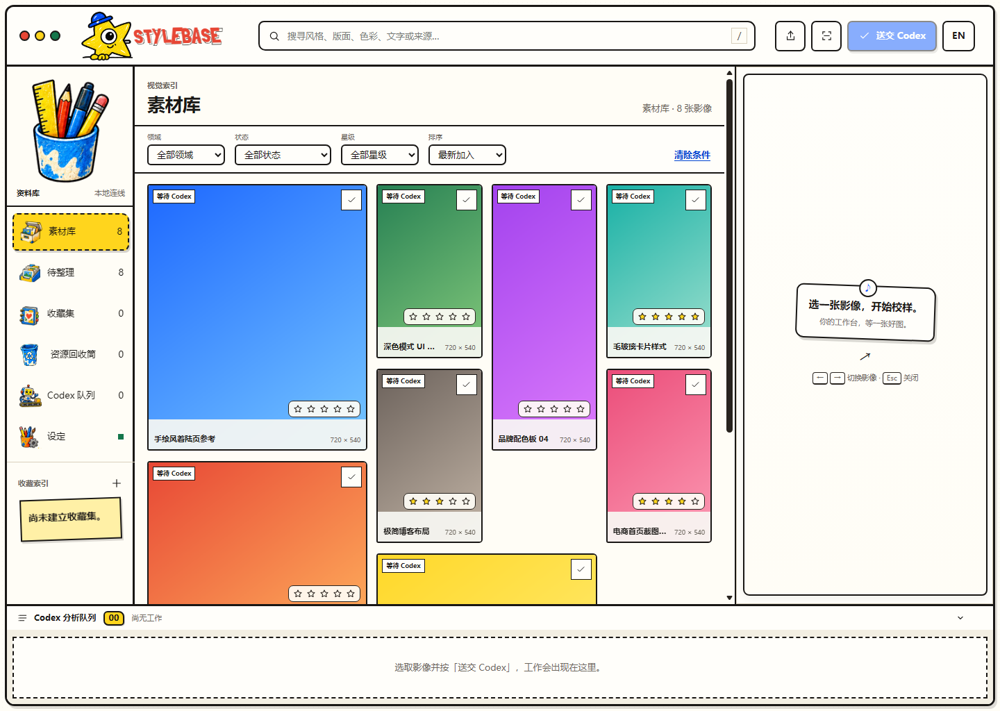

# Stylebase ｜ Design Inspiration Library


A local-first library that turns scattered web, UI, product, and brand design screenshots into a searchable, analyzable collection of implementation prompts. Images and data stay on your machine; nothing leaves it unless you explicitly hit **Send to Codex**, which hands the selected image to your logged-in Codex CLI.



## Highlights

- **Local-first, your data stays yours** — Images and SQLite live only on your machine, fully offline unless you call an AI. The server binds to `127.0.0.1` and is never exposed to your network or the internet.
- **Zero dependencies, clone and run** — No third-party npm packages, no `npm install`. Start it and go.
- **AI analysis turns one image into prompts** — Select an image, hit **Send to Codex**, and get Visual DNA, a color palette, composition and typography notes, implementation suggestions, and a Prompt Kit.
- **A hand-drawn workbench** — Asset grid, analysis queue, and inspector keep the flow from collecting to shipping in one line.
- **Complete organization toolkit** — Full-text search, discipline and style filters, star ratings, favorites, and a trash bin.

## Quick Start

Requirements: Windows 10/11 and Node.js 24 or newer. Zero third-party dependencies, no `npm install`.

```powershell
npm.cmd start
```

Open <http://127.0.0.1:4177> and drag images into the window, or drop them into the `library/inbox` folder and hit **Rescan**.

To use AI analysis, install and log in to the Codex CLI first:

```powershell
npm.cmd install -g @openai/codex
codex login
```

## How It Works

```text
Import images
  → Local scan with SHA-256 deduplication
  → SQLite indexing
  → Browse / search / manually add sources
  → Explicitly send to Codex
  → Single-worker analysis queue
  → JSON Schema validation
  → Visual DNA / palette / Prompt Kit written back
```

1. Put images in `library/inbox` (subfolders work), or drag and drop / paste from the clipboard.
2. Hit **Rescan** in Stylebase.
3. Select an image and press **Send to Codex**; only one analysis job runs at a time.
4. Review and correct the AI's categories, descriptions, and prompts.
5. Add source, author, and license notes so inspiration is not mistaken for free-to-copy assets.

## Data & Privacy

```text
stylebase-design-inspiration-library/
├─ library/inbox/       Original images; ignored by Git by default
├─ data/catalog.sqlite  Local SQLite; ignored by Git by default
├─ public/              HTML, CSS, browser code
├─ src/                 Database, scan, and Codex Agent interfaces
├─ tests/               Automated tests
└─ docs/                Architecture, privacy, and troubleshooting
```

- Importing, scanning, and searching never call an AI; only **Send to Codex** uploads the selected image.
- Stylebase stores no API keys; it reuses your local Codex CLI login.
- Agent jobs run in one-shot sessions with read-only sandboxes and strict JSON Schema validation.
- `data/`, `.env`, SQLite files, and `library/inbox` images are never committed to Git.
- Do not analyze confidential, personal, or unauthorized images.

See [Data, Privacy, and Image Rights](docs/privacy-and-content-rights.md) for details.

## Backup

Stop Stylebase, then back up `library/` (original images) and `data/` (SQLite index and analysis results); restore by putting both folders back in place. Original images are the source of truth — without the database you can rescan, but existing analysis and manual fields must come from a backup.

## Development & Verification

```powershell
npm.cmd run check        # Syntax checks
npm.cmd test             # Unit tests
npm.cmd run validate     # Full gate: check + test + smoke + release checks
```

`validate:release` checks required files, internal Markdown links, version, and license, and blocks `.env`, SQLite, image assets, and common token formats from leaking into the public build.

## Known Limitations

- Primary verification environment is Windows 10/11 with Node.js 24.
- Supports JPG, JPEG, PNG, WebP, and GIF; no video or PDF.
- AI analysis is editable design observation, not fact, legal status, or professional judgment.
- `node:sqlite` may print an ExperimentalWarning on current Node versions; the test suite verifies the features this project needs.

## License

Code and documentation are licensed under the [MIT License](LICENSE).

Images you import are not automatically MIT-licensed by being in Stylebase. They remain subject to the original author, source platform, and individual license terms; check rights before sharing publicly.

## Docs

- [Architecture & Agent Workflow](docs/architecture.md)
- [Data, Privacy, and Image Rights](docs/privacy-and-content-rights.md)
- [Troubleshooting](docs/troubleshooting.md)
- [Verification](docs/verification.md)

## Releases

- `v1.2.0`／2026-08: Bilingual UI (zh/en), hand-drawn redesign, soft delete and trash bin.

Full history in [CHANGELOG.md](CHANGELOG.md).
