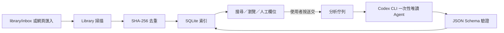

# 系統架構與 Agent Workflow

## 模組

| 模組 | 責任 | 主要檔案 |
|---|---|---|
| Web UI | 匯入、瀏覽、搜尋、Inspector、佇列狀態 | `public/` |
| HTTP Server | 靜態檔案、安全標頭、API、localhost bind | `server.mjs` |
| Library | 掃描、格式檢查、SHA-256、檔案匯入 | `src/library.mjs` |
| Database | SQLite Schema、查詢、FTS5、狀態 | `src/db.mjs` |
| Analysis Contract | Prompt、JSON Schema、正規化與驗證 | `src/analysis-schema.mjs` |
| Codex Adapter | CLI readiness、一次性 Agent、錯誤分類 | `src/codex-agent.mjs` |
| Verification | 單元／整合測試、開源邊界檢查 | `tests/`, `scripts/` |

## 資料流



## 狀態與邊界

### 匯入路徑

1. 接受 JPG、JPEG、PNG、WebP、GIF。
2. 檢查路徑仍位於 Library 根目錄內。
3. 計算 SHA-256。
4. 建立或更新素材紀錄。
5. 不呼叫 Codex。

### 分析路徑

1. 使用者明確選取素材並送交。
2. 工作進入 SQLite 佇列。
3. Worker 一次只取一個工作，降低額度與競態風險。
4. Adapter 確認 CLI 版本與登入狀態。
5. 建立暫存工作目錄與輸出 Schema。
6. 以 `--ephemeral`、`--sandbox read-only`、`-a never` 執行。
7. 驗證完成事件與最終 JSON。
8. 正規化後回寫資料庫。
9. 刪除工作暫存目錄。

### 失敗路徑

錯誤會被分類為：

- 未安裝或不可執行。
- 尚未登入。
- CLI 參數／版本不相容。
- 額度或速率限制。
- 超時。
- 模型輸出不符合 Schema。

失敗不會刪除圖片，也不會阻塞非 AI 功能。

## API 分層

```text
UI
└─ /api/*
   ├─ assets       素材 CRUD、搜尋與篩選
   ├─ import       本地匯入
   ├─ scan         重新掃描
   ├─ analyzers    Codex readiness
   └─ jobs         送交、佇列、重試
```

伺服器只監聽 `127.0.0.1`。若未來要支援區域網路或雲端，不應只改 bind address；還需要身份驗證、CSRF、防暴力請求、檔案隔離、權限與稽核。

## 可擴充方向

### Analysis Adapter

目前只有 Codex Adapter。若增加其他模型，應維持同一個介面：

```js
{
  check(): Promise<AnalyzerStatus>,
  analyze({ imagePath, mimeType }): Promise<ValidatedAnalysis>
}
```

所有 Adapter 都必須遵守：

- 只能由明確的使用者操作觸發。
- 不能把憑證寫進資料庫或前端。
- 回傳結果先經本地 Schema 驗證。
- 記錄 provider、model、schemaVersion 與完成時間。

### 多人版

多人版不能直接共享正在寫入的 SQLite 檔。建議演進順序：

1. 先加入匯出／匯入與備份驗證。
2. 抽象 repository interface。
3. 將圖片移到受控 object storage。
4. 以具身份驗證的 API 與 server database 取代本地直寫。
5. 再增加角色、配額、審計與資料保留政策。

## Agent 分工建議

大型擴充可拆成：

- Product Agent：定義使用情境、非目標與驗收標準。
- Library Agent：檔案安全、去重、縮圖與備份。
- Data Agent：Schema、Migration、搜尋與查詢效能。
- Analysis Agent：Prompt、Schema、Adapter 與成本控制。
- Frontend Agent：可及性、Responsive 與 Inspector Workflow。
- Verification Agent：自動測試、冷啟動、隱私與發行檢查。

每個 Agent 都只修改自己的模組，最後由 Integration Agent 執行 `npm.cmd run validate` 與人工驗收。

## Token 成本優化

- 只有明確選取的圖片才分析，不做自動全庫分析。
- 同一張圖片以 SHA-256 與分析版本避免重複送交。
- 單工佇列避免同時重試造成浪費。
- 嚴格 Schema 減少格式修復回合。
- 搜尋與篩選在 SQLite 完成，不把整個資料庫內容送給模型。
- 未來加入批次時，先做優先級、每日上限與人工預覽，不直接放大並行數。
