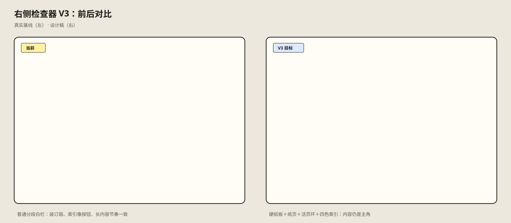

# 阶段 1：前后对比

## 保留不变

- 完整分析内容、图片、色票、Prompt、收藏与 metadata 都保留原位置和语义。
- 四段导航仍为概览／视觉分析／实作输出／资料管理，仍能滚动定位。
- 移动端仍是全屏检查器，仍有返回、关闭和固定主要操作。

## 从当前状态解决的差异

| 当前 | 目标 |
| --- | --- |
| 单一白色侧栏，装订仅为占位背景 | 硬纸板、纸页、装订环与索引耳四层清晰分离 |
| 四个功能按钮并列 | 与内容语义绑定的四色分页索引；当前章节有位置和笔迹反馈 |
| 各区均为相同细线分隔 | 概览像“证据页”，DNA 像“观察笔记”，实作与管理默认降低密度 |
| 移动端顶部按钮与底部重卡片 | 顶部纸质分页与轻量固定纸带，仍保持 44px 触控目标 |

## 确认门

确认以下方向后，才进入阶段 2：暖白纸页＋硬纸板、固定活页环、四色章节索引、克制的预览夹与铅笔标注。确认前不会修改页面实现代码。
