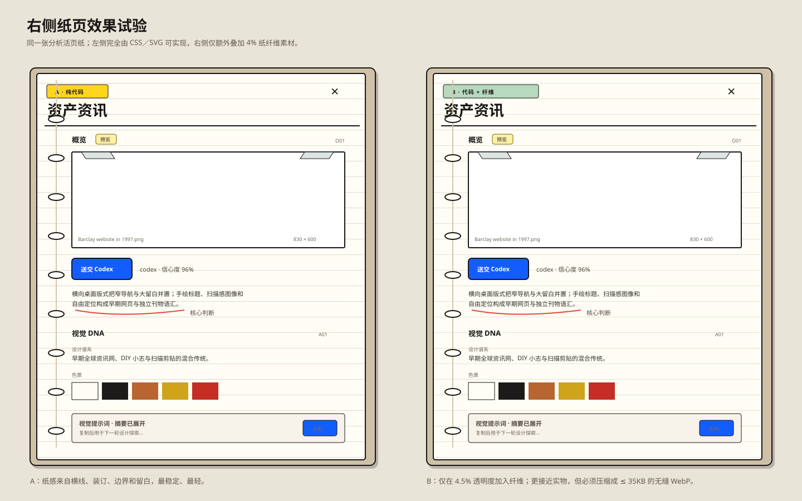

# 纸页效果试验（仅设计稿）

这不是页面实现；两种画面使用完全相同的结构、文字与装订，仅改变纸张底层。

- A：100% CSS／SVG。横线、暖白、硬纸板露边、活页环与纸夹都不依赖位图，最稳定也最轻。
- B：A 的基础上叠加一张生成的纸纤维原图，设计稿中仅以 4.5% 不透明度使用。它使纸面在停留观看时更有材料感，但日常浏览不会抢文字。

生成原图为试验材料，当前 2.1MB，不能直接用于产品。若选择 B，阶段 2 会只保留压缩后的无缝 WebP（目标 ≤35KB），并在文本、色票和所有交互目标下保持足够对比度。
